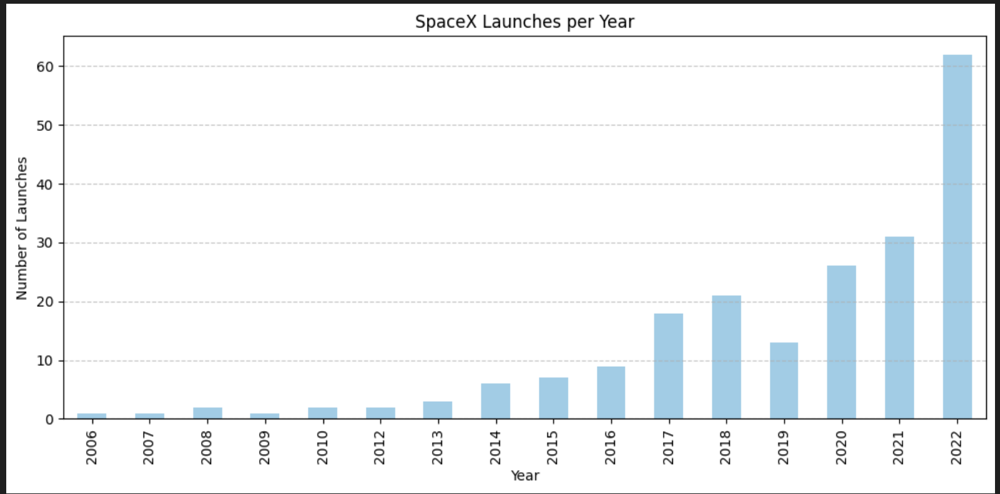

# SpaceX API Analysis 🚀

This project pulls data from the SpaceX public API and performs basic analysis using Python and Pandas.

## Project Goals
- Demonstrate use of APIs to fetch real-world data
- Perform simple data exploration and cleaning
- Showcase API and data wrangling skills for job applications

## Stack
- Python 3
- `requests`, `pandas`,`matplotlib`
- Jupyter Notebook

## Data Sources
- SpaceX REST API: [https://api.spacexdata.com/v4](https://api.spacexdata.com/v4)

## Key Features
- Fetches data from `/launches` and `/rockets` endpoints
- Normalizes nested JSON responses
- Merges launch and rocket data
- Saves cleaned output as CSV for further analysis
- Includes basic visualizations (bar chart of launches per rocket)

## File Structure
- `main.ipynb` — primary notebook doing the fetch and merge
- `data/` — contains output files like `spacex_summary.csv`

## Example Output




## Future Enhancements
- Create a dashboard with Streamlit or Power BI
- Store data in a SQL table

## How to Run
```bash
pip install -r requirements.txt
# or install manually:
pip install pandas requests matplotlib
